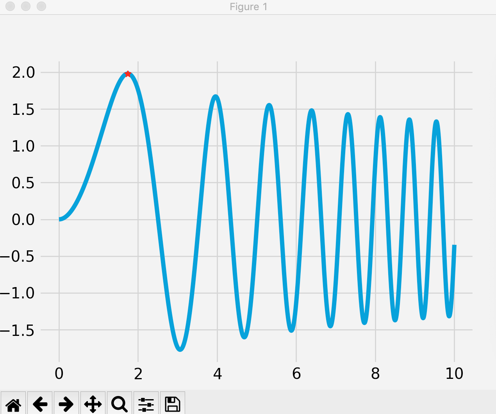

# Artificial-Intelligence

**_Python_** code programmed using **_Object Oriented Design_**, **_Data Structures_** and high level **_Algorithms_** are used to solve problems in a "Artifical Intelligent" Manner (**_Non-Machine Learning_**, More **_Algorithms/Data Structure_** & **_Probabilistic Reasoning_**)

## 8-Puzzle.py: Application of Searching Algorithms

Programmed an **_AI_** to help solve classical game **_8-Puzzle_**. I programmed **_4 Classes_**, a **_Node_** class, **_Tree_** class, **_Board_** class, and a **_PuzzleSolver_** class, I use my **_Tree Data Structure_** with given **_Nodes_** as states of the board to **_branch out_** all possible configurations of moves the board allows until the goal is reached using **_breadth first search_** but with some added components... I use methods to help **_optimize time complexity_** such as **_memoization_** so that the same board states would not get recalculated and I added a **_heuristic_** to help make my search faster, thus making my algorithm **_""Intelligent""_**, I also added a **_timer_** where you can see the time difference when using the heuristic vs when not using it, and adding the **_heuristic_** definately helps improve performance

## SimulatedAnnealing.py & SimulatedAnnealing.mov

Programmed a **_Simulated Annealing_** algorithm which is an **_optimization algorithm_**, more specifically it is a **_probabilistic technique for approximating the global optimum of a given function_**, I tested out my algorithm on a function in **_2D Space_** that contains many **_local maxima & local minima_** and it converges to the **_global optimum_** with high accuracy by **_probabilistically escaping local minima/maxima_**, I added an **_animation graph_** of my algorithm searching for the global optimal using **_Matplotlib.Animation_**, a movie clip is avaiable of this optimization search under **SimulatedAnnealing.mov**

## N-Queens.py: Application of Constraint Satisfaction Problem

Programmed an **_AI_** that helps solve a classical **_Constraint Satisfaction Problem_** called **_N-Queens_**. I implement a **_recursive algorithm_** to help me search possible states in my constrained domain, this part of the algorithm is the **_forward search_**, if the search states reach a point where no possible solutions exist I implemented **_backtracking_** so it can search previously unsearched states
